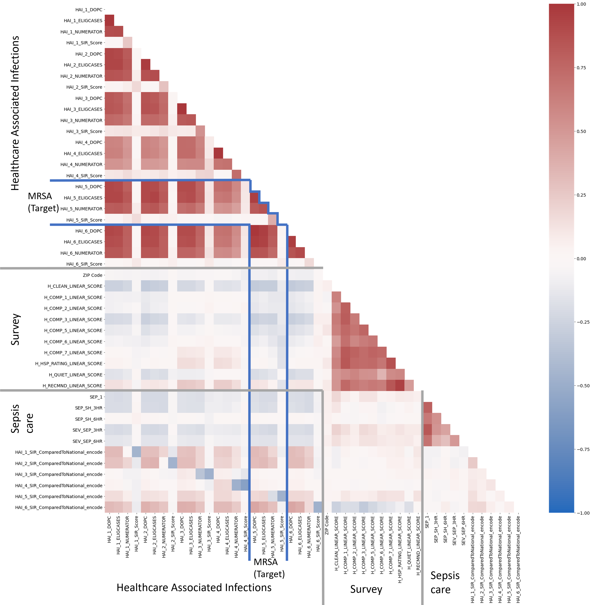
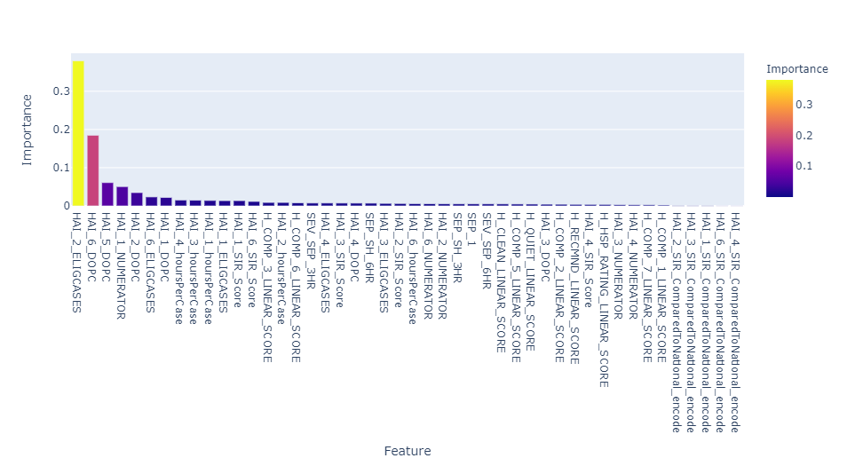
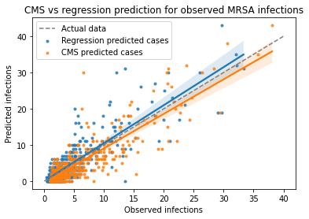
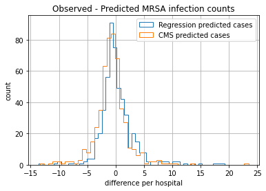

#  
SpringBoard Capstone 1 of 2

## Purpose
The goal of this project was to predict MRSA infections at the hospital level in a given year (2019), given data about other hospital associated infections, patient survey scores and sepsis treatment score ratings.  

__Significance:__

"At any given time, about 1 in 25 inpatients have an infection related to hospital care. These infections lead to tens of thousands of deaths and cost the U.S. health care system billions of dollars each year." - [Health.gov, health care associated infections](https://health.gov/our-work/health-care-quality/health-care-associated-infections)

I chose MRSA infections as it seemed the least influenced  by certain medical procedures or medical tools, compared with the other HAI data types (i.e. not related to a specific surgery or device (such as a catheter infection)).  Being able to predict either the standardized score OR how many patients may get infections could help hospitals assess performance.

## 1. Data Source
All data used in this project are publicly available from the United States CMS (centers for Medicare and Medicaid).  Don't be fooled by the name -  these data are not restricted to only Medicaid or Medicare patients.  They are used to rank hospitals nationwide.  I pulled the 2019 data for the 3 data sets below and combined them together for this project.  2019 was the most recent year of complete data due to issues with data collection during the COVID-19 pandemic in 2020. 

**Healthcare Associated Infections (HAIs)** [CMS data source]([https://data.cms.gov/provider-data/dataset/77hc-ibv8])
  - How often patients get an infection while in the hospital. This contains what I'm trying to predict, MRSA infections.  This measure is categorized into several different types and means of infections (related to equipment, procedures, or location of infection).  It is also compared to a national benchmark for that type of hospital, and standardized to some degree based on things like how many beds at the hospital, lab methods used, affiliation with a medical school, patient age and some others. 

**Patient survey (HCAHPS)** [CMS data source](https://data.cms.gov/provider-data/topics/hospitals/hcahps#hcahps-star-ratings) 
  - this survey is administered to patients at random (not just Medicare patients).  This has 19 questions about the hospital + 10 other demographic and screening questions. ([details on questions here](https://data.cms.gov/provider-data/topics/hospitals/hcahps#about-the-hcahps-survey) )

Star rating and linear score (part HCAHPS survey results) 
  - Star rating summarizes the patient survey responses by category, and is rolled into a single 'summary star' rating per facility. ([details here](https://data.cms.gov/provider-data/topics/hospitals/hcahps#hcahps-star-ratings))

**Timely and Effective Care** [more details about the data](https://data.cms.gov/provider-data/dataset/yv7e-xc69)
  - Includes several measures about specific topics, each topic is given a rating based off what has been shown to be best practice or most important with that procedure.  Most relevant measures here is sepsis - "percentage of patients with severe sepsis or septic shock for which a hospital provides appropriate care". ([more details about the data](https://data.cms.gov/provider-data/topics/hospitals/timely-effective-care))

## Data Cleaning

I combined all three data sources and standardized them to be one line per hospital facility.  Here's a few other things I did along the way:

* Initially had 4878 facilities:

* I dropped all facilities with no HAI data, lowering it to 3096 facilities left.

Survey data

* Extracted just the linear scores and star ratings data
* Removed surveys that didn't cover the entire year 2019

Timely and effective care

* Removed all but the Sepsis data
* Dropped the "Samples" size column, which may point to some facilities with a small sample size bias.  

**Final HAI_tidy table**

* 3096 hospitals with 77 features.

* Contains survey data and sepsis treatment data from the relevant tables

* Has significant missing data in some features (>60%).

* Is missing ~44% of target prediction feature (HAI_5_SIR)

  

## EDA (exploratory data analysis)

 
 *Correlation heat map of primary variables.  The MRSA  target variables (variable I'm trying to predict) is outlined in blue*

EDA indicated that there was very little correlation with HAI SIR scores and any other variables.  Meaning this would be a hard value to predict with regression!

Here's a few take away seen in the above correlation heatmap.

 * Each of the three original data sets have a significant amount of internal correlation, but limited correlation to the others. 

 * My Interpretation:
     * We can see some positive correlations between different lengths of sepsis care, indicating hospitals that are good at short or long-term care are typically good at both
     
     * We see positive correlation with different survey rankings, indicating good scores in one area is correlated with good scores in another.
     
     * The main correlation with HAI data relate to how many infection cases, and how many hours were spent on them.  In other words, hospitals with many MRSA infections typically see many other infection types.  This can be changed by standardizing for patient count and other hospital biases.  The CMS does this called the SIR score, which does not have those types of correlations.  This makes the SIR score a good standardized value.  It's calculated like so:
     
      

     * A high SIR means the hospital has more infections than predicted, and a low score indicates the opposite.  This implies there's some baseline number of infections we expect in any given situation.
     
     

## Algorithms and Machine Learning

At this point I did a little more data cleaning to prep for machine learning.  One was to remove the upper and lower confidence limits for the HAI data, location data (state, zip codes).  I also removed anything with a null MRSA SIR score

This brought the data down to 1715 rows and 50 columns. The data was split to reserve 30% for testing and leave 70% for training.  

Typically only a single feature is used as that target, and this is 'hidden' from the model.  In this case, I have four features that are highly related, so I removed all from the model, but only try to predict one at a time.

* MRSA observed cases
* MRSA predicted cases (by the CMS)
* MRSA SIR score
* MRSA SIR compared to national category (either below, same, or above).

Attempts to predict the SIR score gave very poor results.  I instead focused on predicting the number of observed cases instead.  

### Modeling

I chose to work with [Scikit Learn's Random Forest Regressor](https://scikit-learn.org/stable/modules/generated/sklearn.ensemble.RandomForestRegressor.html?highlight=random%20forest%20regressor#sklearn.ensemble.RandomForestRegressor ).  I then tuned the random forest trying both a coarse grid, and then a random search (but more refined)  grid.  These boosted the final score a little (~ 0.2 mean absolute error and r² ~ 0.01).

The random forest model was still overfit, giving a much better train score than the test scores.  I went forward with it nonetheless.

 *Feature importance of random forest model for predicting MRSA number of observations*

The two most important features are from HAI type 2 and 6, Catheter Associated Urinary Tract Infections and Clostridium Difficile (C.Diff).  It appears there's at least a correlation between those HAIs (healthcare associated infection) and MRSA HAIs.  For the  meaning of the rest of these, take a look at the [name abbreviation files in the appendix](#File-Overview).

## Outcomes
The initially tried to predict the MRSA 'SIR' score (Standardized Infection Ratio) per hospitals.  It turns out the SIR score has so many factors baked into it, I couldn't predict this directly with the information given (my predictions were worse than just guessing the mean SIR).

I was able to predict the total number of observed cases at a given hospital before standardization with a mean absolute error of 1.99 cases.  My prediction is on 2019 data about other infections, patient survey results and average care of sepsis patients.

The CMS (Center for Medicaid and Medicare Services) who provide these data have their own predictions.  Their prediction is based on historical data combined with information about the hospital.  How do my results compare?

 *Different data predicting similar results*

The metrics show the two results are very similar

**My regression prediction metrics** (only 2019 data)
median_r2, test 0.583
median MAE, test:  1.991
median MSE, test 9.996

**CMS prediction metrics** (historic data before 2019)
median_r2, test 0.687
median MAE, test:  2.063
median MSE, test 9.474

 *Error histograms, actual cases minus predicted cases*

#### Interpretations and conclusions:

My random forest regression performs just about as well at predicting the number of observed cases as the CMS does using several other data sets.  Here's what that means to me:

* There's a strong correlation between MRSA infections, other types of HAIs.
* MRSA infections associated with healthcare  are predictable to some extent
* How well patient's rank a hospital (based on surveys) and how well hospitals treat patients with sepsis has a much lower correlation with MRSA cases than other HAI types does.

## Future Improvements

* Incorporate healthcare facility size (how many patients seen per year) and type of facility.  I refer to them all as 'hospitals' but that's a simplification.
* Include historic data on infections
* Look more at geographic trends, especially with historic data
* Even more fun: hone in beyond the hospital aggregation level - what tests, procedures, and other data exists, ideally at a by-case detail level to help unravel this problem?

## Credits

Mukesh Mithrakumar - my Springboard mentor, who keeps me from getting lost in the weeds. CMS - for abundant data made available to the public.

## Appendix
__More details on SIR score__
The CDC calculates a Standardized Infection Ratio (SIR) which may take into account the type of patient care location, number of patients with an existing infection, laboratory methods, hospital affiliation with a medical school, bed size of the hospital, patient age, and classification of patient health.  Also check out [Connecticut's department of public health page](https://portal.ct.gov/DPH/HAI/What-is-the-SIR-and-What-Does-it-Mean)  which has a friendly description of SIR.

### File overview

| Files                                                 | Description                                                  |
| ----------------------------------------------------- | ------------------------------------------------------------ |
| 01_Wrangling_HAI_tidy_report.html                     | Step 1 output - Pandas profiling EDA report                  |
| Name Abbreviations HAI_Names_ID_xref.csv              | Explanation of feature names related to HAI (Hospital associated infections) |
| Name abbreviations HCAHPS survey_ID_Questoin_Xref.csv | Explanation of survey features                               |
| Name abbreviations Sepsis.csv                         | Explanation of sepsis features                               |
| requirements.txt                                      | python requirements file for reproducibility                 |

| Data files                                           | Description                                                  |
| ---------------------------------------------------- | ------------------------------------------------------------ |
| data/HAI_tidy_Encoded.csv                            | Master table with data encoded as digits instead of text categories |
| data/HAI_tidy_Wrangled.csv                           | Output of step 1, data wrangling                             |
| data/HCAHPS-Hospital.csv                             | Raw 2019 survey data                                         |
| data/Healthcare_Associated_Infections_-_Hospital.csv | Raw 2019 Healthcare associated infections data               |
| data/Timely_and_Effective_Care-Hospital.csv          | Raw 2019 sepsis (and other treatment) data                   |

### Notebooks
| Notebook                             | Description                                                  |
| ------------------------------------ | ------------------------------------------------------------ |
| 01_DataWrangling.ipynb               | From raw data to 'tidy' format, main outcome is the cleaned HAI_tidy_Wrangled.csv file |
| 02_ExploratoryDataAnalysis_HAI.ipynb | EDA notebook, includes many visualizations, main output is HAI_tidy_Encoded.csv |
| 03_Preprocessing_and_Modeling.ipynb  | Final notebook for model application, tuning and scoring.    |

**Related data** (https://data.cms.gov/provider-data/dataset/yv7e-xc69)
  - In case that wasn't enough links, here's one more. Other datasets included in comparing hospitals that have not been used in this study. 
